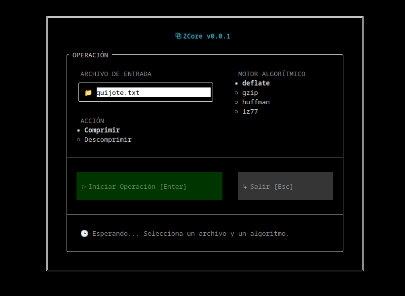

# ⚡ ZCore Compression Engine


**ZCore** es un motor de compresión de datos de grado industrial escrito desde cero en C++ moderno. Diseñado con una arquitectura modular y concurrente, ZCore implementa los algoritmos de compresión más populares (Huffman, LZ77, Deflate, Gzip) garantizando bajo consumo de memoria RAM ($O(1)$) sin sacrificar velocidad, gracias a sus tablas de hash en cadena integradas y su procesamiento por bloques (Chunks).

Cuenta con una **Interfaz Gráfica de Terminal (TUI)** de alto nivel diseñada con `FTXUI` y una CLI robusta potenciada por `CLI11`.

<div align="center">
  
</div>

---

## ✨ Características Principales

*   🧠 **Arquitectura Stream-Agnostic por Chunks:** El motor nunca intenta cargar todo el archivo en la memoria. Lee y procesa en ráfagas de tamaño fijo de **4MB**, lo que permite comprimir archivos masivos de 5GB consumiendo menos de 10MB de RAM.
*   ⚡ **Motor LZ77 Ultrarrápido:** Búsqueda retrospectiva optimizada mediante **Chained Hash Tables** (*Lookups O(1)*), logrando velocidades de procesamiento de decenas de megabytes por segundo en un solo hilo al evitar el temido $O(N \cdot W)$.
*   🗜️ **Cuatro Algoritmos Nativos:**
    *   **Huffman:** Árboles de prioridad generados localmente y diccionarios empotrados por bloque.
    *   **LZ77:** Ventana deslizante continua (Buffer Circular) que conserva el historial entre transiciones de chunks.
    *   **Deflate:** El estándar dorado de la industria (LZ77 + Huffman combinados).
    *   **Gzip:** Deflate acoplado con cabeceras, metadatos y sumas de comprobación CRC32 (*RFC 1952*).
*   🎨 **FTXUI TUI Interactiva (Dual Mode):** Un *Worker Thread* independiente procesa los bits mientras el hilo principal renderiza a 60 FPS una interfaz fluida, con barras de progreso nativas y componentes interactivos sin bloqueos.
*   📂 **Auto-Enrutamiento de Extensiones:** 
    *   GZIP `-> .gz` | DEFLATE `-> .df` | LZ77 `-> .l7` | HUFFMAN `-> .huf`
    *   *(Reconstrucción Inteligente: Descomprimir un `.gz` elimina la extensión para restaurar el archivo en su estado prístino).*

---

## 🚀 Compilación e Instalación

Asegúrate de tener instalado un compilador moderno (GCC 9+ o Clang 10+) y **CMake**.

```bash
# 1. Clonar el repositorio
git clone https://github.com/elisbanpaco/zcore.git
cd zcore

# 2. Configurar en Modo de Máximo Rendimiento (Release)
cmake -B build -DCMAKE_BUILD_TYPE=Release

# 3. Compilar el proyecto (descargará automáticamente CLI11 y FTXUI)
cmake --build build
```

---

## 💻 Guía de Uso

### 1. Interfaz Gráfica (TUI Interactiva)
Si ejecutas el motor sin argumentos, la hermosa interfaz interactiva de consola se lanzará automáticamente:
```bash
./build/compressor
```
*También puedes forzarla escribiendo `./build/compressor --tui`.*

### 2. Línea de Comandos (CLI para Servidores)
Diseñada para ser encadenada en scripts Bash o flujos automatizados de servidor (CI/CD):

**Comprimir (Auto-genera las extensiones pertinentes):**
```bash
./build/compressor -c -a deflate -i dataset.bin
```

**Descomprimir:**
```bash
./build/compressor -d -i dataset.bin.df
```

**Ver opciones y menú de ayuda:**
```bash
./build/compressor --help
```

---

## 🏗️ Arquitectura del Sistema (Staff Engineer Level)

El motor ZCore fue reescrito en la **Fase 1 y Fase 2** siguiendo metodologías estrictas de ingeniería de software:

*   **Pura Inversión de Dependencias:** `Compressor.hpp` exige `std::istream` y `std::ostream`. Los algoritmos no conocen archivos físicos (Disco), solo flujos de bytes (Streams). Esto permite inyectar datos de red HTTP o flujos simulados directamente en memoria sin modificar la lógica principal.
*   **Thread-Safety Absoluto:** Al evitar las variables globales en favor de objetos en la Pila (*Stack*) o punteros inteligentes, el núcleo algorítmico garantiza inmunidad contra *Race Conditions* y *Data Races* al ser paralelizado.
*   **Control Asíncrono de UI:** La interfaz separa el renderizado asíncrono (Main Thread) de la Fuerza Bruta algorítmica disparando closures desacoplados (`std::thread(...).detach()`), y reportando actualizaciones de barras de progreso vía Callbacks seguros (`screen.PostEvent(Event::Custom)`).

---

## 🛠️ Entorno de Pruebas (Test Suite)
El proyecto está blindado por una suite de pruebas profesionales escritas en **Catch2** (v3), divididas en dos fases críticas de validación:

1. **Fase de Integridad (100% Lossless):** Garantiza matemáticamente que los datos no sufran corrupción. Utilizando flujos de memoria (`std::stringstream`), el test somete fragmentos de texto altamente repetitivos a los motores de **Huffman, LZ77, Deflate y Gzip**, comprimiendo y descomprimiendo la data para asegurar que la salida es una réplica *Byte a Byte* del archivo original.
2. **Fase de Estrés Virtual (O(1) Space Complexity):** El sistema hereda de `std::streambuf` para crear un Agujero Negro y un Generador de Datos en Memoria. Inyecta **5 Gigabytes** de información directamente en el algoritmo Deflate. Se extrae el uso de memoria RAM (VmRSS) directo de Linux garantizando que el uso de Heap Memory jamás exceda el límite establecido de 30MB extra.

Para ejecutar los tests:
```bash
cmake --build build
./build/test_compression -d yes
```

---
<div align="center">
  <p align="center">Construido con ❤️ para la comunidad</p>
</div>
